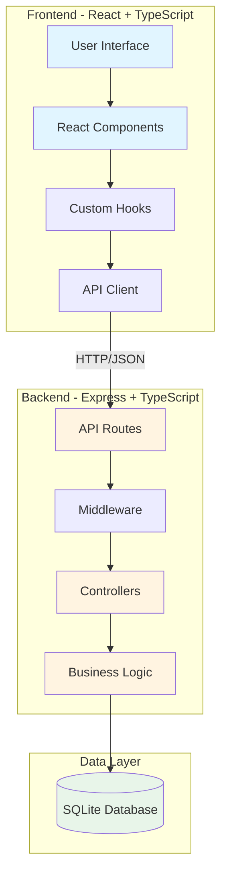
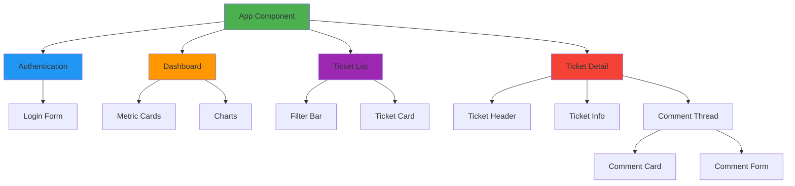
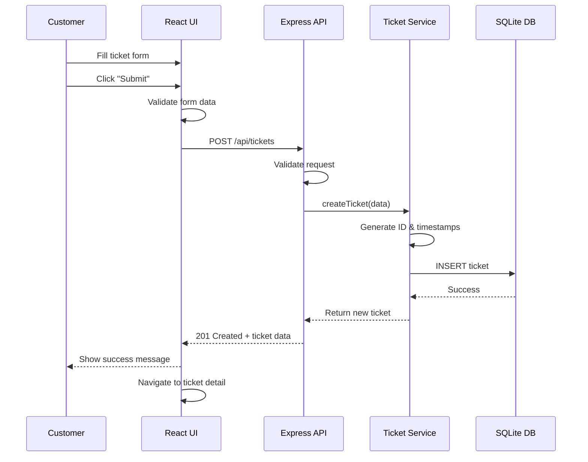
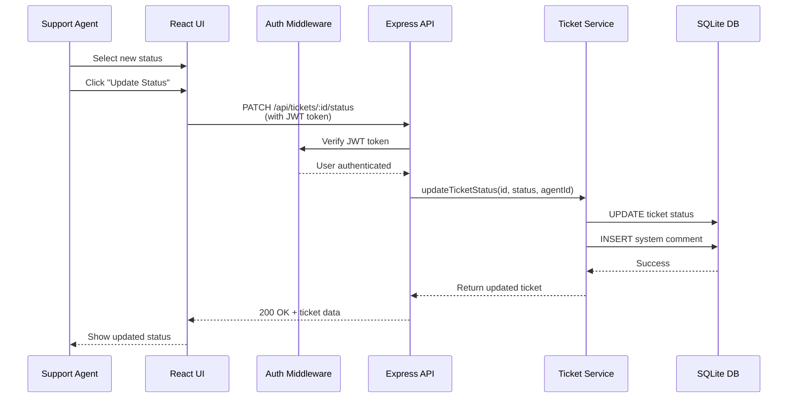
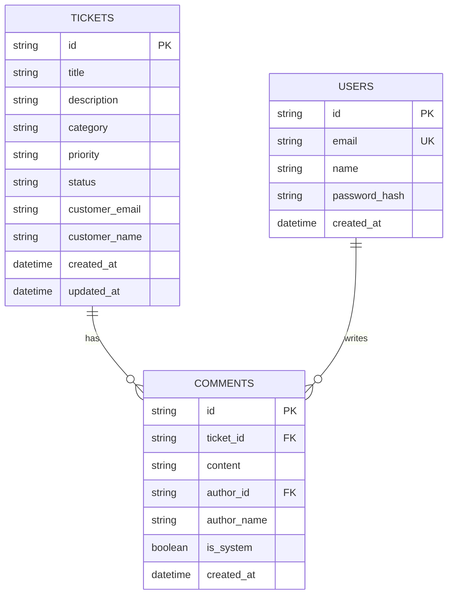
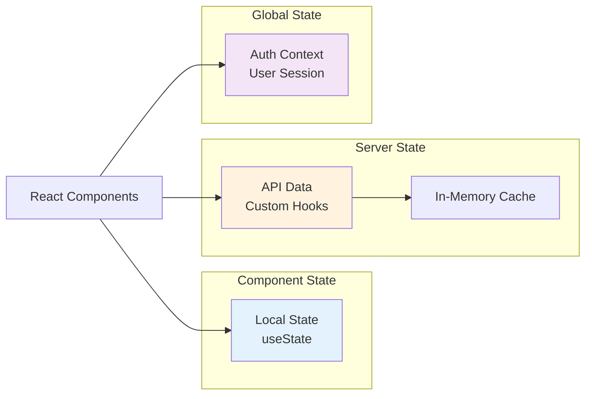
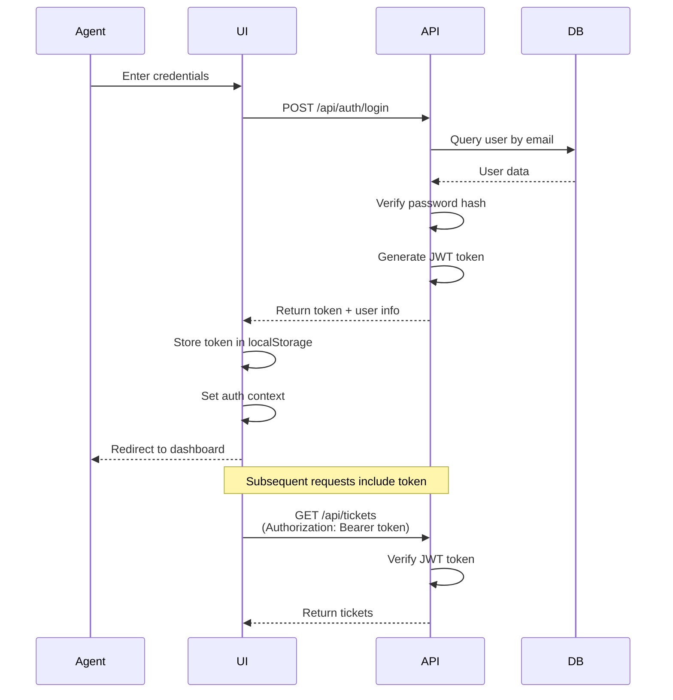
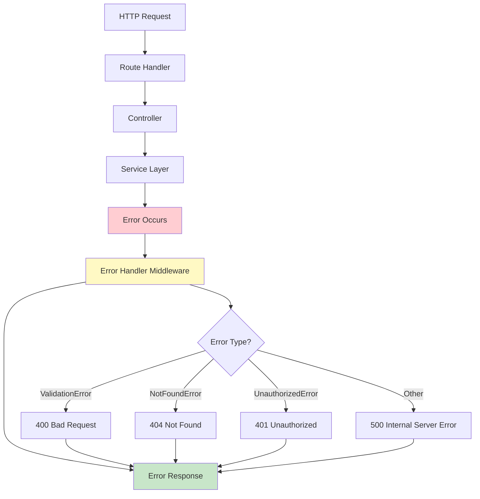
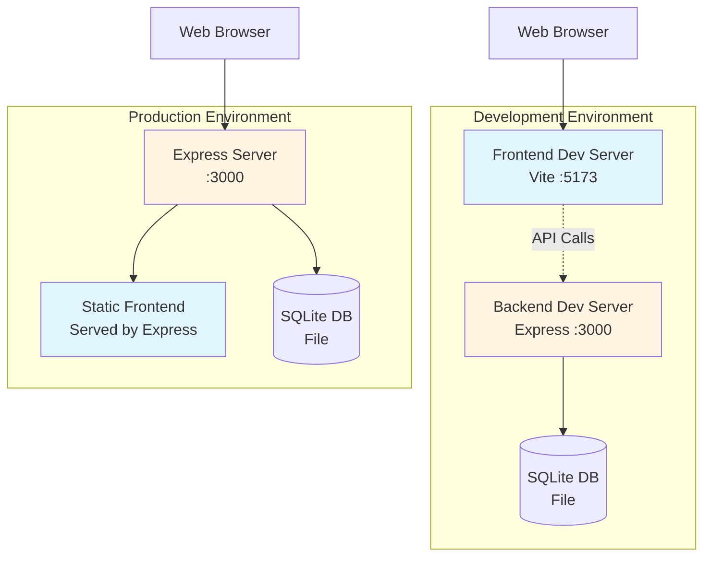

# Architecture Overview

This document provides a high-level overview of the Customer Support Ticket System architecture, including system diagrams and component interactions.

## System Architecture



## Component Architecture

### Frontend Component Hierarchy



## Data Flow

### Ticket Creation Flow



### Ticket Status Update Flow



## API Endpoints

### RESTful API Structure

```
Authentication
├── POST   /api/auth/login          # Agent login
└── POST   /api/auth/logout         # Agent logout

Tickets
├── GET    /api/tickets             # Get all tickets (with filters)
├── GET    /api/tickets/:id         # Get single ticket
├── POST   /api/tickets             # Create new ticket
├── PATCH  /api/tickets/:id         # Update ticket
├── PATCH  /api/tickets/:id/status  # Update ticket status
└── POST   /api/tickets/:id/comments # Add comment

Dashboard
└── GET    /api/dashboard/metrics   # Get dashboard metrics
```

## Database Schema



## State Management

### Frontend State Architecture



## Authentication Flow



## Error Handling Flow



## Deployment Architecture



## Technology Stack Summary

### Frontend
- **Framework**: React 18 with TypeScript
- **Build Tool**: Vite (fast dev server and build)
- **Styling**: Tailwind CSS (utility-first CSS)
- **HTTP Client**: Fetch API (native browser API)
- **Routing**: React Router (client-side routing)

### Backend
- **Runtime**: Node.js with TypeScript
- **Framework**: Express.js (web server)
- **Database**: SQLite (embedded database)
- **Authentication**: JWT (JSON Web Tokens)
- **Security**: Helmet (HTTP headers), CORS

### Development Tools
- **Package Manager**: npm or yarn
- **TypeScript Compiler**: tsc
- **Linting**: ESLint
- **Formatting**: Prettier

## Key Design Principles

1. **Separation of Concerns**: Clear boundaries between UI, business logic, and data access
2. **Type Safety**: TypeScript throughout for compile-time error detection
3. **RESTful API**: Standard HTTP methods and status codes
4. **Stateless Backend**: JWT tokens for authentication, no server-side sessions
5. **Component Composition**: Small, reusable React components
6. **Error Handling**: Centralized error handling with custom error types
7. **Code Comments**: Extensive documentation for new developers
8. **Consistent Patterns**: Established patterns for routes, controllers, and services
